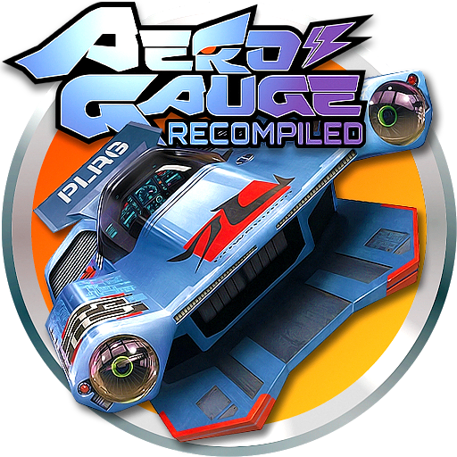

# AeroGauge: Recompiled

AeroGauge: Recompiled is a PC version of the Nintendo 64 racing game AeroGauge.
It runs your own copy of the game in a native window.

This version includes an in-game settings screen. Some visual enhancements and
less common hardware paths still need more testing; see Known limitations.
The details below describe this checkout. A release archive can predate it, so
check the release notes before expecting newly merged features.

## Supported computers

Release targets are:

- Windows 10 or later, 64-bit, with Direct3D 12 support.
- Linux, 64-bit, with Vulkan support.
- Android 9 or later, ARM64, with a compatible Vulkan driver. See
  [Android setup](docs/android.md) for touch controls, ROM import, and GPU drivers.

macOS is not a supported target in this branch. A build that compiles on
another system is not proof that the game runs there.

## Run a release

On Android, install the APK and use **Import ROM** in the app, then **Play
AeroGauge**. See [Android setup](docs/android.md). Desktop instructions:

1. Download the archive for your system from
   [GitHub Releases](https://github.com/alondero/aerogauge-recomp/releases).
2. Extract it to a folder.
3. Put your legally dumped copy of the USA game in that folder. Name it
   `AeroGauge (USA).z64`.
4. On Windows, start `aerogauge_modern.exe`. On Linux, start
   `./aerogauge_modern`. To add AeroGauge to the Linux applications menu with
   its icon (including native Wayland taskbars), run
   `./install_linux_launcher.sh` once and start it from the menu. If you move
   the extracted folder, run the installer again to refresh the launcher.

The archive contains the program and its support files. It does not contain the
game ROM. Other ROM releases are not supported.

## Build from source

Building from source is a developer task and requires a matching ROM. See
[BUILDING.md](BUILDING.md) for the tools and complete commands.

## Controls

These are the default port bindings:

| Action | Keyboard | Gamepad |
| --- | --- | --- |
| Confirm / accelerate | X | A |
| Cancel / brake | C | B |
| Steer | Arrow keys or W/A/S/D | Left stick |
| Drift | Z | Left trigger |
| Pause / advance | Enter | Start |
| L button | Q | Left shoulder |
| R button | E or R | Right shoulder or right trigger |
| C buttons | I/J/K/L | X/Y/right stick |

The port exposes one physical controller as Controller 1.

## Settings

Open the settings screen with **Escape**, **F10**, or controller **Back**.
This also works in fullscreen. Use the mouse, keyboard, or controller D-pad.
The screen shows the active button prompts.

The **Graphics** page controls resolution, widescreen display, HUD placement,
presentation rate, anti-aliasing, window mode and size, and texture paths.
**Force Full LOD** keeps cars at maximum model detail and removes their distance
cutoff; the Draw distance setting still controls far clipping. It is off by default.
Press **Apply** to keep graphics changes. Press **Discard** to cancel them.

The **Enhancements** page controls draw distance, full-course geometry, and
Easy Turbo + Boost Start. These changes are saved as soon as they are made.
Full-course geometry is experimental and can cost performance or show visual
errors. Easy Turbo changes the driving controls; it is off by default.
With Easy Turbo on, press the R button during a race to start Turbo and use the
assisted Boost Start.

The **Controls** page edits the single-player keyboard and controller bindings.
F11 and Alt+Enter switch fullscreen. Graphics API and texture-path changes take
effect after a restart.

## Saves and files

The program stores its files in these locations:

- Windows: `%LOCALAPPDATA%\AeroGaugeRecomp\`
- Linux: `$XDG_CONFIG_HOME/AeroGaugeRecomp`, or
  `~/.config/AeroGaugeRecomp`
- Portable mode: the folder from which you run the program, when that folder
  contains a file named `portable.txt`

The contents of `portable.txt` do not matter. Its presence selects portable
mode.

`graphics.json` stores display settings, including draw distance and
full-course geometry. `enhancements.json` stores the Easy Turbo + Boost
Start assist setting. Game saves are in the `saves` subfolder. Back up
that folder before testing a new build.

## Known limitations

- The USA release is the only supported ROM.
- The settings screen does not support multiplayer player assignment.
- Full-course geometry is experimental.
- Texture packs and texture dumps are developer features. They are not a
  general mod system.
- Platform, graphics-driver, and physical-controller coverage is incomplete.
- The settings screen is not shown by headless test runs.

See the [documentation map](docs/README.md) for developer documentation, test
commands, and configuration details.

## Special thanks

Thanks to [Gary (POOTERMAN)](https://www.deviantart.com/pooterman) for creating
and sharing the fan art featured at the top of this README and used for the
Windows, Linux, and Android application icons.

## License

Project code is licensed under [LICENSE](LICENSE). The game and dependency
submodules have their own licenses. You must provide your own ROM.
