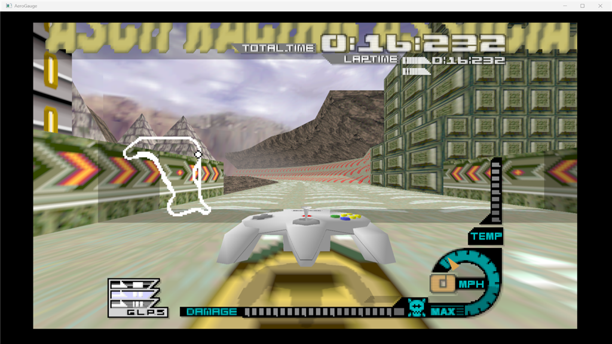
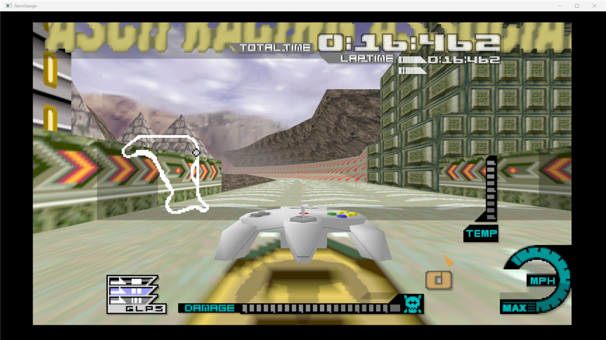
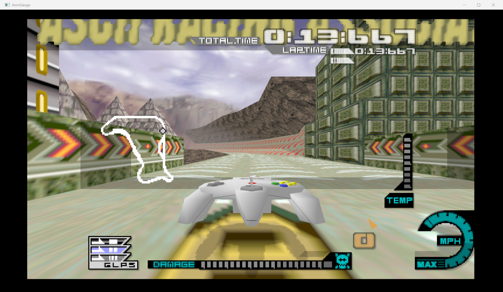
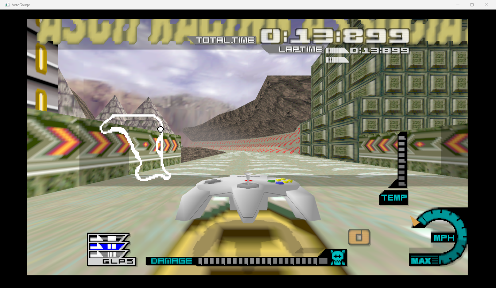
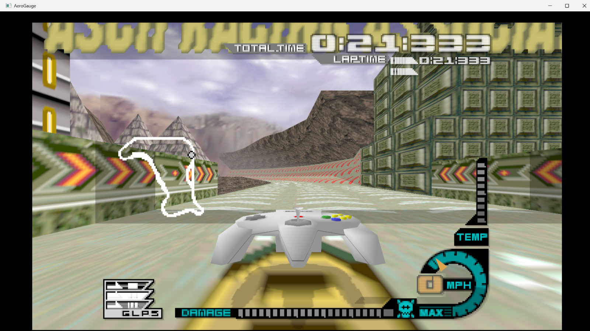
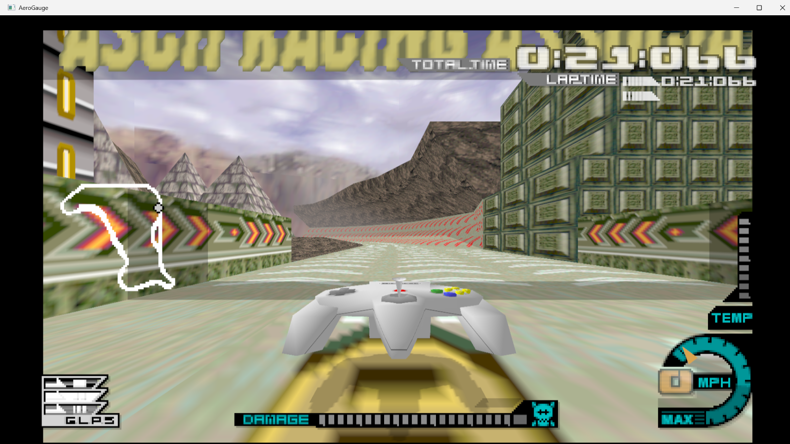

# Widescreen 1P HUD pinning (issue #1)

Under RT64 `ar_option: Expand`, untagged 2D is rendered centred in the 4:3 region, so the
1P race HUD's edge-anchored elements float inboard of the widescreen edges. The fix tags
the HUD's texrects with RT64 extended-GBI `gEXSetRectAlign` (+ a wide scissor so the moved
rects aren't clipped at the 4:3 edge), injected as N64Recomp `[[patches.hook]]` natives in
`src/aero_hud_widescreen.c`. At 4:3 / non-Expand RT64 leaves the tagged rects put, so every
bracket is a no-op there — no config gate needed. The pure classification/scaling math
lives in `src/aero_hud_widescreen.h` with `tests/test_hud_shift_scale.c`.

## How the HUD is drawn (live-derived; see the `.claude/hud-*.gdb` harnesses)

AeroGauge does NOT use static per-element draw calls like the Lamborghini port. The 2D
master dispatcher **`func_80022408`** walks object lists and calls each object's draw handler
**indirectly** (`jalr` through a per-object function pointer at `obj+0x104` and `obj+0x34`).
So there is no static per-element call site to bracket — the element identity lives in the
handler function and the per-object data.

- **DL write cursor holder = fixed global `0x8016C508`**; cursor = `MEM_W(0, holder)`. Every
  2D helper reads it, stores a command, advances it by 8. At a handler's entry the holder is
  passed in `a0` (== `ctx->r4`); it is clobbered inside the handler, so a bracket saves it at
  entry and the reset re-reads the cursor through the saved value.
- The DL is **double-buffered** (cursor alternates `0x8018xxxx` / `0x80173xxx` frame to
  frame), so absolute DL addresses are never stable — always go through the holder. HUD
  texrect offsets ARE stable *within* a buffer once the mode-4 race settles (~`send_dl` 900).

## Element attribution (mode-4 1P canyon race, steady HUD)

| element | screen x | anchor | handler | dispatcher site |
|---|---|---|---|---|
| speedometer box | 247..300 | RIGHT | `func_80018CF0` (exclusive) | `func_80022408` :10729 (obj+0x104) |
| TEMP gauge | 291..300 | RIGHT | `func_80018EA0` (mixed) | `func_80022408` :10871 (obj+0x34) |
| GLPS | 20..64 | LEFT | `func_80018EA0` (mixed) | `func_80022408` :10871 (obj+0x34) |

Low-level texrect emitter for all: `func_80019D0C`. The centred DAMAGE bar `func_8003A190`
is off both handler paths and is not drawn in the plain canyon race (never bracketed).

## Shipped (issue #1, first increment): speedometer RIGHT pin

Historical: the first increment bracketed `func_80018CF0` (small and speedo-exclusive, one
call/frame) with a dedicated hook pair at `0x80018CF0`/`0x80018D5C`. That bracket was
verified at the DL level (exactly one bracket per frame wrapping only the speedo texrect)
and later subsumed by the whole-frame retag pass below, which classifies the dial ring
RIGHT from its own coordinates — the dedicated hooks were removed with the retag increment.

Visual before/after (real RT64 D3D12 render, 1600x900 16:9 canyon race). `hr_option: Original`
leaves the tagged rects put (== pre-fix behaviour); `Clamp16x9` applies the pin. Note only the
speedometer moves — TEMP / GLPS / lap-timer are the retained follow-up below:

| before (`hr_option: Original`, unpinned) | after (`hr_option: Clamp16x9`, speedo pinned right) |
|---|---|
|  |  |

Capture recipe (windowed, this machine): set `hr_option` in
`%LOCALAPPDATA%\AeroGaugeRecomp\graphics.json`, run `AERO_WARP=1:1 ./build/aerogauge_modern.exe`,
wait ~40 s for the steady race HUD, PrintWindow-grab the "AeroGauge" window (flag 2 =
PW_RENDERFULLCONTENT captures the D3D12 swapchain). 4:3 and 21:9 remain a human spot-check.

## Shipped (issue #1, second increment): speedometer NEEDLE pin (2026-07-12)

The first increment moved ONLY the cyan dial-ring texrect (`func_80018CF0`, DL slot
`0x18C440`, decode `(247,172)-(300,224)`), leaving the orange needle and the "0" MPH digit
behind (user-reported "split speedo"). The needle is now pinned too; live-derived facts:

- **Orange needle = a single matrix-rotated triangle, NOT a texrect.** In the DL it is
  `MTX 0x18C4C8 (01030040 -> 0x801854B0, push)`, `MTX 0x18C510 (01020040 -> 0x80185970,
  load modelview)`, then `G_DL 0x18C518 (06000000 -> 0x800995C0)`. The sub-DL `0x800995C0`
  is a STATIC ROM resource (`SETCOMBINE / SETPRIMCOLOR B56014FF (orange) / VTX 0x80099590 /
  TRI1 0-2-4 / ENDDL`) — address-stable, so it is the robust discriminator: "the `0102/0103
  0040` MTX immediately before a `G_DL -> 0x800995C0`" uniquely identifies the needle without
  depending on the double-buffered matrix-pool address.
- **No dedicated handler.** The needle is one node of the generic RECURSIVE scene-graph
  transform walker `func_800226AC` (build mtx via `func_80024370` concat + `func_8006C230`
  store to obj+0x9C, push `G_MTX`, recurse obj+0xA0/0xA4), reached `func_8001E8D8 ->
  func_80022408 -> func_800222C0 -> func_800226AC(recursive)`. So the shift is NOT a
  dedicated-handler bracket like the dial ring; it mirrors Lamborghini's `patch_load_mtx_dx`.
- **Implementation** (`src/aero_hud_widescreen.c`, hooks in `scripts/gen_syms_toml.py`
  PATCH_BLOCKS): a matched pair brackets the whole 2D dispatcher `func_80022408` (not
  recursive, same holder `0x8016C508` buffer) — entry `before_vram=0x80022408`
  (`aero_ws_hud_scan_begin`) latches the DL cursor; epilogue `before_vram=0x80022680`
  (`aero_ws_needle_shift`, after every child handler appended, before the register restores)
  walks `[start,end)`, finds the needle MTX by the `0x800995C0` key, and adds `dx` to its
  matrix translate.x (element 12 = byte 24 int / byte 24+0x20 frac, s15.16 — identical layout
  to Lamborghini's guMtxL; MEM_H/MEM_HU handle the endian + KSEG masking).
- **Matrix unit = one 320-space pixel; the shift is ANALYTIC, not calibrated** (corrected
  2026-07-16 — the original hand calibration of `41` was systematically short and left the
  needle ~45 px inboard of the pinned dial, user-reported). Live-logging the modelview at
  the hook shows translate.x int part `114` with the needle at screen x `160+114=274`, and
  a probe confirmed the ratio (41 units moved the needle 158 px while the dial travelled
  203 px; `41/53.3 == 158/205`). So **`AERO_WS_NEEDLE_DX = 53.333`** = the rects' own 16:9
  travel in the same space, `320*(16/9 / (4/3) - 1)/2`. Env-overridable. Scaled off
  `aero_ws_get_hud_rect_aspect_bits()` => 0 at 4:3/Original (no-op, no config gate), caps
  at 16:9 under Clamp16x9. Verified: needle/digit offsets relative to the dial's right
  edge now match the Original layout within 3 px.

Before/after (real RT64 D3D12, 1616x939 16:9 canyon race; needle only — the "0" digit below
is the retained follow-up):

| before (needle detached, drifts inboard) | after (`AERO_WS_NEEDLE_DX=41`, needle on the dial) |
|---|---|
|  |  |

Windowed capture recipe for recalibration: `scratchpad/capture.ps1 <out.png> <dx> [waitSec]`
(recreate on demand — launches windowed `AERO_WARP=1:1`, waits for the steady HUD, PrintWindow
flag 2 grabs the swapchain). Attribution harness: `.claude/needle-watch.gdb` (watches the
needle modelview `0x80185970` write). `hr_option: Original` = unshifted reference.

## Shipped (issue #1, third increment): whole-frame per-texrect retag pass (2026-07-16)

The remaining rect elements ("0" MPH digit, TEMP, GLPS, lap times, top row, …) all flow
through MIXED handlers — `func_80018EA0` draws TEMP (right) **and** GLPS (left) inside one
call — and the dispatcher disassembly killed the hoped-for finer seam: `func_80022408`'s
`jalr group+0x34` site (`0x80022644`) is called once per *group* (four groups per frame,
`v0 += 0x38` stride), not per element, so no call-boundary bracket can ever separate them.

The shipped mechanism instead post-processes what the frame actually emitted. The existing
dispatcher bracket (`aero_ws_hud_scan_begin` at entry, `aero_ws_hud_frame_end` at the
`0x80022680` epilogue) snapshots the emitted `[start, end)` and re-emits it in place with
pin brackets (rect-align + wide scissor push/pop) inserted around runs of same-anchor
texrects, each rect classified **by its own coordinates** in the original 320-wide space
(`aero_ws_classify_rect_qp`, thresholds measured from the steady mode-4 capture):

- RIGHT if `ulx >= 168`: dial ring 247..300, lap-time row 171..301, MPH digit 247..267 +
  its scale ticks 187.., TEMP 274..300, top lap/position row 170..302. The white
  "TOTAL.TIME" header (107..169, y23..31) crosses the deadband but natively sits
  immediately left of the big digits, so it is special-case matched (top strip only) and
  travels with the timer group.
- LEFT if `lrx <= 100`: the GLPS ladder 20..64 AND **the whole minimap**. Live G_MTX
  probing (2026-07-16) disproved the earlier "polyline geometry" note: shifting every
  live modelview matrix moved the sky backdrop, the craft and the whole 3D scene but
  never the white track outline — it is baked into the TEXTURE of the 20..100 x y70..172
  texrect (and sits exactly inside it), so the map + its craft-blip rect pin LEFT like
  any other rect. The blip's coordinates are DYNAMIC (it tracks the craft), so besides
  the threshold there is a containment box (16..108 x y66..176): any rect inside the
  minimap band pins LEFT even when its lrx wanders past 100 at the map's right edge.
  The 100 bound itself stays below the DAMAGE bar's left edge (117) so its left-anchored
  fill rect (117..117 when empty, growing rightward) never pins at any damage level.
- everything else stays: DAMAGE 117..229, the 71..247 bottom panel, countdown numerals.

Safety posture (each verified against the pre capture): race scene + steady-phase gate
(`0x8013FF80 == 5` and phase `0x8013FF88` in {3 = steady race, 7 = steady attract};
menus compose 4:3 layouts and the race entry phases 1/2 sweep full-screen wipe rects —
neither may pin; the gate covers the needle shift too, so the needle never moves while
the unpinned dial is still centred), whole-frame skip if any in-range `G_DL` target,
force-close on the
game's raw mid-HUD `G_SETSCISSOR` and on 3D commands, bounded growth (~10 commands per
bracket, ~7 brackets/frame) against a measured >=4KB of free space after the frame DL
end, `AERO_WS_RETAG=0` kill-switch for pre/post captures.

Before/after (real RT64 D3D12, 1600x900 16:9 canyon race; `hr_option: Original` = the
unpinned reference layout, `Clamp16x9` = every rect element pinned):

| `Original` (unpinned reference) | `Clamp16x9` (retag pass live) |
|---|---|
|  |  |

Alignment was verified by pixel measurement, not by eye: at eff-16:9 the rect travel is
`(16/9-4/3)*H/2` ≈ 191 px and the dial/TEMP/timer/GLPS/minimap all land flush at the
image edges preserving each element's NATIVE margin (timer's rightmost rect is natively
19/320 from the screen edge, GLPS/minimap natively 20/320 — those margins scale up with
the window and are intentional); the needle/digit offsets relative to the dial match the
Original layout within 3 px; `Original` re-measures pixel-identical to pre-change.

## Remaining follow-ups

- **Rival craft markers on the minimap** (multi-craft GP races): five white 2-triangle
  meshes (`G_DL -> 0x803AF560..680`, matrix-positioned) are culled in 1P warp races and
  were NOT exercised by this work — in a multi-craft race they may need a matrix shift to
  track the LEFT-pinned map texture. Spot-check in a GP race.
- **Human spot-check** at 4:3 / 16:9 / 21:9 with Original/Clamp16x9/Full HUD modes, plus
  the race pause overlay and 2P behaviour.
